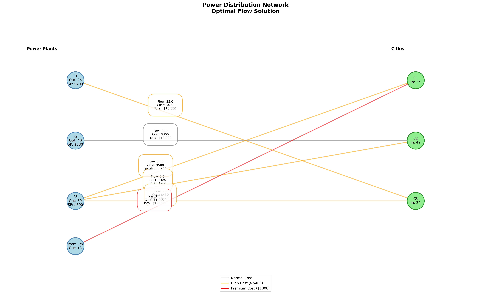

# Power Distribution Network Optimization

This project implements a power distribution network optimization model using Python, solving the minimum cost flow problem for power distribution from plants to cities.

## Problem Description

The model optimizes power distribution from multiple power plants (P1, P2, P3, and a Premium source) to three cities (C1, C2, C3), considering:

- Plant capacity constraints
- City demand requirements (with 20% safety margin)
- Transmission costs
- Network flow constraints

## Visualization



### Network Components:

- **Blue Nodes**: Power Plants (including shadow prices)
- **Green Nodes**: Cities (with demand requirements)
- **Edge Colors**:
  - Gray: Normal cost routes
  - Orange: High cost routes (≥$400)
  - Red: Premium cost routes ($1000)

## Key Features

1. **Power Plants**:

   - P1: 25 million kWh capacity
   - P2: 40 million kWh capacity
   - P3: 30 million kWh capacity
   - Premium: Unlimited capacity (backup source)

2. **Cities (Demand + 20% margin)**:

   - C1: 36 million kWh
   - C2: 42 million kWh
   - C3: 30 million kWh

3. **Optimization Results**:
   - Total System Cost: $49,710
   - All base plants operating at full capacity
   - Premium source used for additional demand
   - Shadow prices showing opportunity costs for capacity increases

## Implementation Details

The solution uses:

- `NetworkX`: For network modeling and visualization
- `PuLP`: For linear programming optimization
- `Matplotlib`: For visualization rendering

## Shadow Prices Analysis

The shadow prices indicate potential cost savings per unit of capacity increase:

- P1: $400/unit
- P2: $680/unit
- P3: $500/unit

These values show the potential cost reduction if we increase the capacity of each plant by one unit.

## Requirements

```
networkx
pulp
matplotlib
numpy
```

## Usage

Run the script using:

```bash
python node_network_lp.py
```

This will:

1. Solve the optimization problem
2. Display the optimal flows and costs
3. Show shadow prices analysis
4. Generate the network visualization
